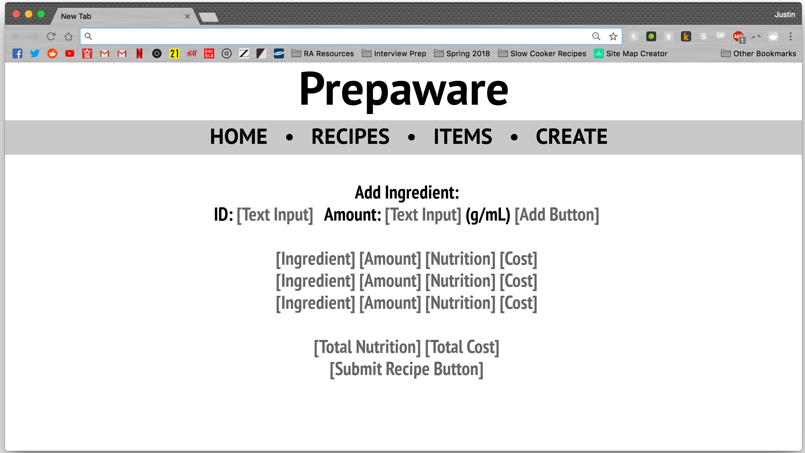
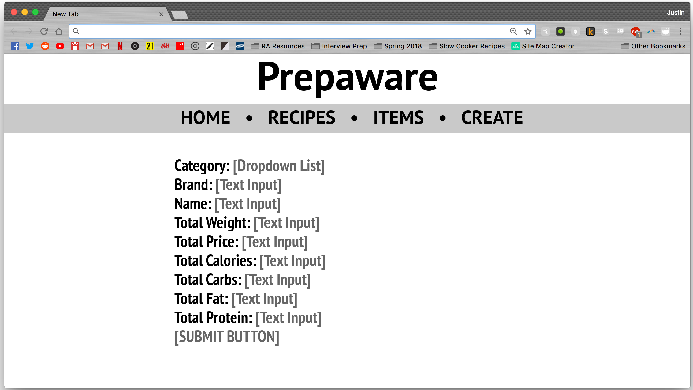
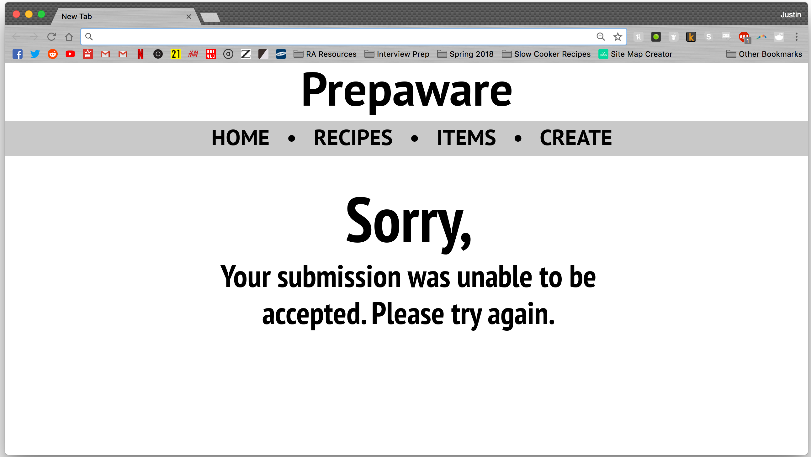

# Prepaware

## Overview

Meal Prepping is a very useful process for people attempting to eat well, yet on a budget, and in many cases, get fit. However, the uncertainty about specific nutritional value and monetary value of meals can steer people away from the attempt.

Prepaware  is a web application that will allow users to add ingredients and their prices, create recipes with those ingredients, and receive information on the cost and nutritional value of their meals.

## Data Model

The application stores grocery items and recipes.

* Every recipe contains at least one item (partially embedded; modified)

An example grocery item:

```javascript
{
    category: "dairy",
    brand: "Trader Joe's",
    name: "Sliced Sharp Cheddar Cheese",
    slug: "sliced-sharp-cheddar-cheese", // used to create unique URL for individual recipe page
    price: 3.99,
    displayPrice: "3.99", // Useful for ensuring two significant figures (ex. 3.5 vs 3.50)
    servings: 12,
    weight: 336, // Total weight for grocery item (NOT just one serving)
    cals: 1320, // (NOT just one serving)
    carbs: 0, // Measured in grams (NOT just one serving)
    fat: 108, // Measured in grams (NOT just one serving)
    protein: 84, // Measured in grams (NOT just one serving)
}
```

An example recipe with (partially) embedded grocery items:

```javascript
{
    name: "Macaroni & Cheese",
    "slug":"macaroni-cheese",
    servings: 1, //# of individual servings yielded by the recipe
    ingredients: [
        { "slug":"alfredo-sauce", "protein":"2", "fat":"7", "carbs":"3", "cals":"80", "price":"0.41125", "weight":"62", "name":"Trader Joe's Alfredo Sauce" },
        { "slug":"macaroni-pasta", "protein":"7", "fat":"1", "carbs":"44", "cals":"210", "price":"0.12375", "weight":"56", "name":"Trader Joe's Macaroni Pasta" },
        { "slug":"sliced-sharp-cheddar-cheese", "protein":"7", "fat":"9", "carbs":"0", "cals":"110", "price":"0.3325", "weight":"28", "name":"Trader Joe's Sliced Sharp Cheddar Cheese"}
    ],
    price: 0.8675,
    displayPrice: "0.87",
    cals: 400,
    carbs: 47, // Measured in grams
    fat: 17, // Measured in grams
    protein: 16 // Measured in grams
}

```

## [Link to Schemas](src/db.js) 

## Wireframes

/ - the homepage for Prepaware


/[recipes/items] - page for displaying currently existing recipes/grocery items


/create - page for providing the user with an option to create a recipe or add an ingredient


/create/recipe - page for providing the user with a form to create and submit a recipe



/create/item - page for providing the user with a form to create and submit a grocery item/ingredient



/create/success - page for notifying the user that the submitted recipe/item has been accepted and added


/create/failure - page for notifying the user that the submitted recipe/item has been rejected



## Site map


## User Stories

1. As a viewer, I want a recipes page so that I can look at the list of recipes posted on the website.
2. As a viewer, I want a grocery items page so that I can look at the list of ingredients posted on the website.
3. As a creator, I want a grocery items page so that I can see what ingredients are available for creating recipes, and determine if I need to add any ingredients.
4. As a creator, I want to be able to create a recipe and contribute to the community.
5. As a creator, I want to be able to add an ingredient in case I want to create a recipe and the website doesn’t already have the ingredient.

## Research Topics

* (3 points) Gulp
	* Gulp is "an open-source JavaScript toolkit by Fractal Innovations" (wikipedia).
	* The use of a toolkit proved beneficial towards the efficient creation of the web application.
	* (Point value specified by rubric)

* (2 points) ESLint
	* ESLint is a "pluggable linting utility for JavaScript" (eslint.org).
	* The use of ESLint assisted in development by helping maintain consistency in clear and concise code, more critical as the web application increases in scale.
	* The gulp-eslint plugin was used.
	* (Point value specified by rubric)
	* [Screen Capture of Use (YouTube)](https://www.youtube.com/watch?v=PL7CMiGzqzA)

* (2 points) Sass
	* Sass is "the most mature, stable, and powerful professional grade CSS extension language in the world" (sass-lang.com).
	* The use of Sass aided in the styling of the webpages of Prepaware, as intuitive topics such as variable usage and nesting became available in creating stylesheets.
	* The gulp-sass plugin was used.
	* (Point value specified by rubric)
	* [Screen Capture of Use (YouTube)](https://www.youtube.com/watch?v=tDL3xak1euQ)

* (1 point) Web Fonts via Sass (NEW)
	* Google Web Fonts provide a large number of fonts available for use to anyone with the desire to use them.
	* Sass provided an opportunity for the efficient importing of desired web fonts.
	* A sass-web-fonts module (via NPM) was used.
	* This module proved to be very straightforward and simple to apply.

* (1 point) Auto-Incrementing
	* Auto-incrementing is a concept that would ensure a unique identifier for every document in a collection (note: ObjectID already does that, but potentially asking the user to remember/re-type such a long string may not be feasible).
	* Auto-incrementing alloedw for the formation of a unique ID for every grocery item in the database, and provided a solution for easy ingredient insertion when a user creates a recipe.
	* A mongoose-auto-increment plugin was used.
	* This module was straightforward and simple to apply; however, it was be a critical component of recipe creation and is thus vital to the project.

9 points total out of 8 required points

## [Link to Main Project File](src/app.js) 

## Annotations / References Used

Gulp

1. [Gulp.js Plugins](https://gulpjs.com/plugins/)

ESLint

1. [gulp-eslint plugin](https://www.npmjs.com/package/gulp-eslint)

Sass

1. [gulp-sass plugin](https://www.npmjs.com/package/gulp-sass)
2. [Sass Basics](https://sass-lang.com/guide)
3. [Gulp.js – Compiling Sass (YouTube)](https://www.youtube.com/watch?v=NkomAUQxYr8)

Web Fonts (via Sass)

1. [sass-web-fonts (Github)](https://github.com/alyssais/Sass-Web-Fonts)
2. [sass-web-fonts (npm)](https://www.npmjs.com/package/sass-web-fonts)

Auto-Increment

1. [mongoose-auto-increment plugin](https://www.npmjs.com/package/mongoose-auto-increment)

Miscellaneous

1. ["Unable to set default directory for views"](https://github.com/ericf/express-handlebars/issues/147)
2. [Provided code used as model for initial directory structure and initial app.js](https://github.com/nyu-csci-ua-0480-008-spring-2018/jjv222-homework06/tree/master/src)
3. [Carter One Font (via Google Fonts)](https://fonts.google.com/?category=Display&selection.family=Carter+One)
4. ["Disabled form inputs do not appear in the request" (StackOverflow)](https://stackoverflow.com/questions/7357256/disabled-form-inputs-do-not-appear-in-the-request)