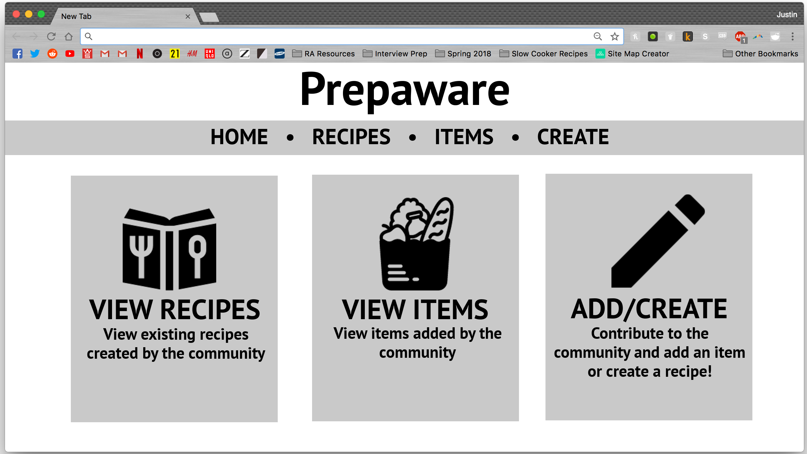
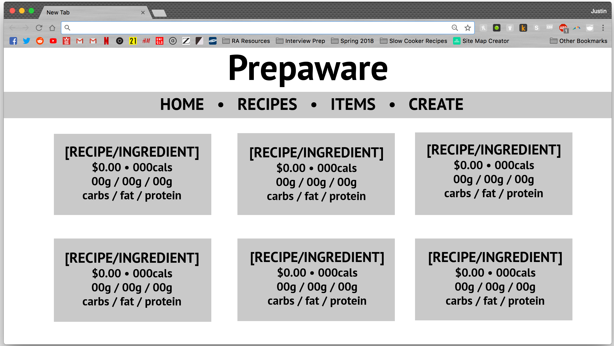
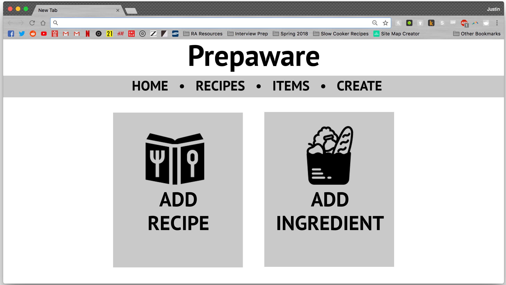
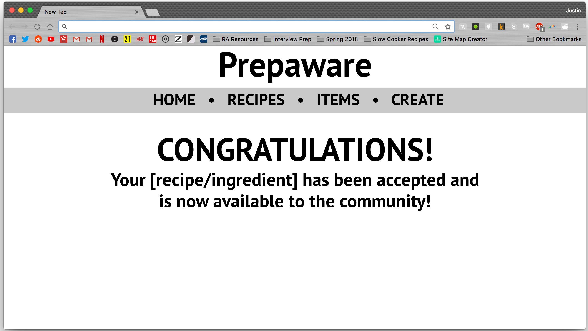
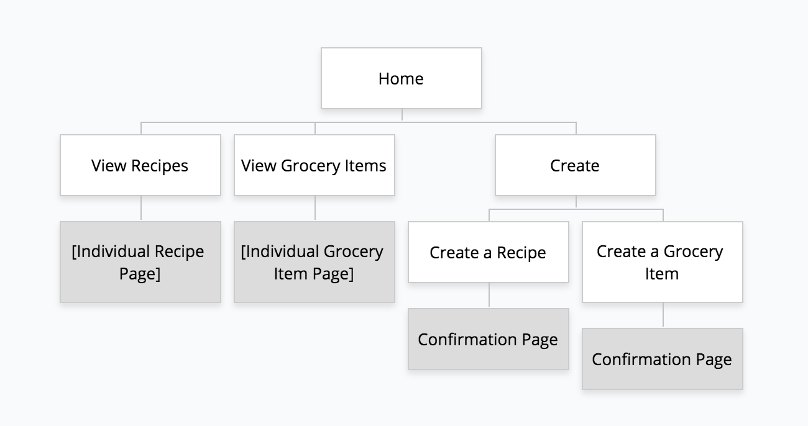

# Prepaware

## Overview

Meal Prepping is a very useful process for people attempting to eat well, yet on a budget, and in many cases, get fit. However, the uncertainty about specific nutritional value and monetary value of meals can steer people away from the attempt.

Prepaware  is a web application that will allow users to add ingredients and their prices, create recipes with those ingredients, and receive information on the cost and nutritional value of their meals.

## Data Model

The application will store grocery Items and Recipes.

* Every recipe can contain multiple items (embedded; slightly modified)

An example grocery Item:

```javascript
{
	category: “canned/jarred goods”,
	brand: “Trader Joe’s”,
	name: “Carolina BBQ Sauce”,
	weight: 510, //g or mL
	price: 2.69
	cals: 900,
	carbs: 210,
	fat: 0,
	protein: 0
}

```

An example Recipe with embedded grocery Items:

```javascript
{
	name: “Jerk Chicken”,
	servings: 4,
	ingredients: [
		{ category: “meat”, brand: “Trader Joe’s”, name: “boneless skinless chicken breast”, weight: 908, price: 5.58, cals: 880, carbs: 0, fat: 0, protein: 176},
		{ category: “canned/jarred goods”,  brand: “Grace’s”, name: “hot jerk marinade”, weight: 60, price: 1.32, cals: 0, carbs: 0, fat: 0, protein: 0}
	]
	price: 6.90,
	cals: 880,
	carbs: 0,
	fat: 0,
	protein: 176
}

```

## [Link to Commented First Draft Schema](db.js) 

(___TODO__: create a first draft of your Schemas in db.js and link to it_)

## Wireframes

(___TODO__: wireframes for recipe/item submission forms)

/ - the homepage for Prepaware



/[recipes/items] - page for displaying currently existing recipes/grocery items



/create - page for providing the user with an option to create a recipe or add an ingredient



/create/[recipe/item]/confirmation - page for notifying the user that the submitted recipe/item has been accepted and added



## Site map



## User Stories

1. As a viewer, I want a recipes page so that I can look at the list of recipes posted on the website.
2. As a viewer, I want a grocery items page so that I can look at the list of ingredients posted on the website.
3. As a creator, I want a grocery items page so that I can see what ingredients are available for creating recipes, and determine if I need to add any ingredients.
4. As a creator, I want to be able to create a recipe and contribute to the community.
5. As a creator, I want to be able to add an ingredient in case I want to create a recipe and the website doesn’t already have the ingredient.

## Research Topics

* (3 points) Gulp
	* Gulp is "an open-source JavaScript toolkit by Fractal Innovations" (wikipedia).
	* The use of a toolkit will be beneficial towards the efficient creation of the web application.
	* (Point value specified by rubric)

* (2 points) ESLint
	* ESLint is a "pluggable linting utility for JavaScript" (eslint.org).
	* The use of ESLint will aid in development by helping maintain consistency in clear and concise code, which becomes more critical as the web applications increases in scale.
	* A gulp-eslint plugin exists and is expected to be used.
	* (Point value specified by rubric)

* (2 points) Sass
	* Sass is "the most mature, stable, and powerful professional grade CSS extension language in the world" (sass-lang.com).
	* The use of Sass will aid in the styling of the webpages of Prepaware, as intuitive topics such as variable usage and nesting become available in creating stylesheets.
	* A gulp-ruby-sass plugin exists and is expected to be used.
	* (Point value specified by rubric)

* (1 point) Auto-Incrementing
	* Auto-incrementing is a concept that would ensure a unique identifier for every document in a collection (note: ObjectID already does that, but potentially asking the user to remember/re-type such a long string may not be feasible).
	* Auto-incrementing would allow for the formation of a unique ID for every grocery item in the database, and can provide a solution for easy ingredient insertion when a user is creating a recipe.
	* A mongoose-auto-increment plugin exists and is expected to be used.
	* This module appears to be very straightforward and simple to apply; however, this will be a critical component of recipe creation and is thus vital to the project.


8 points total out of 8 required points


## [Link to Initial Main Project File](src/app.js) 

(___TODO__: create a skeleton Express application with a package.json, app.js, views folder, etc. ... and link to your initial app.js_)

## Annotations / References Used

1. [gulp-eslint plugin](https://www.npmjs.com/package/gulp-eslint)
2. [gulp-ruby-sass plugin](https://www.npmjs.com/package/gulp-ruby-sass)
3. [mongoose-auto-increment plugin](https://www.npmjs.com/package/mongoose-auto-increment)